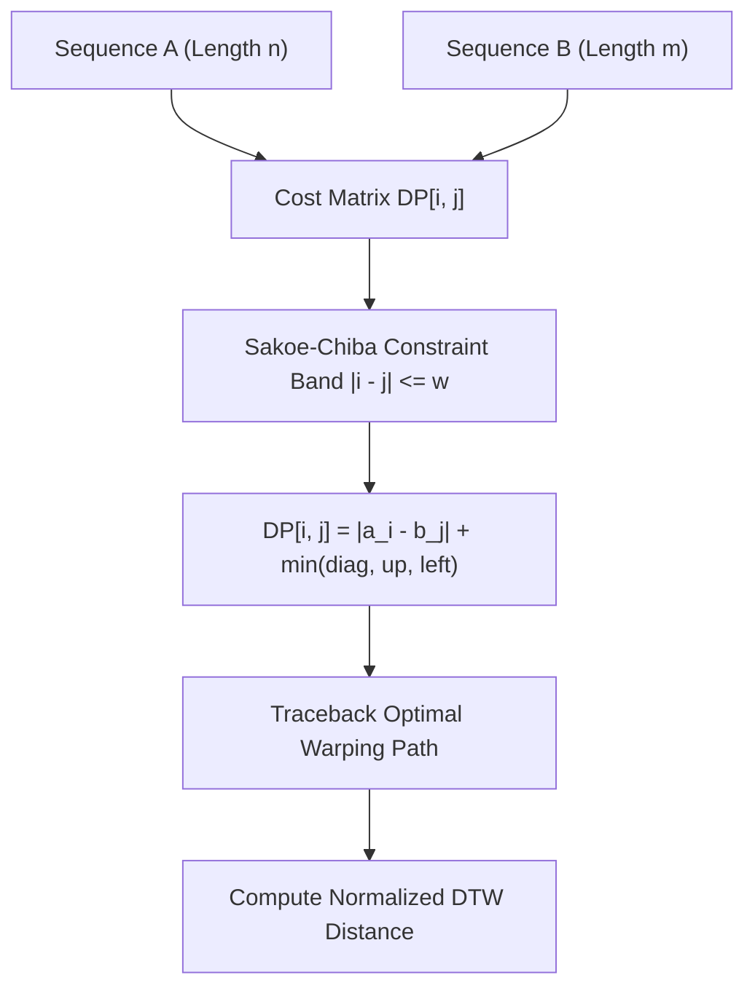

# genpark-dynamic-time-warping-dtw-alignment-skill

Agent Skill implementing **Dynamic Time Warping (DTW)** with Sakoe-Chiba constraint band for optimal non-linear temporal sequence similarity and warping path alignment.

## Architectural Overview

