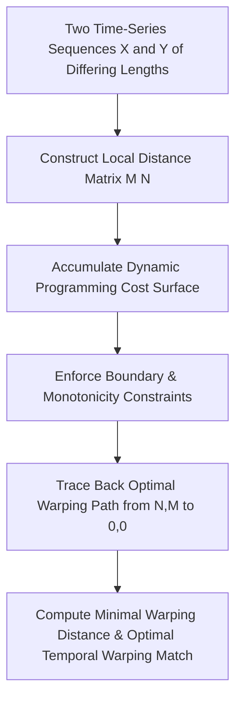

# genpark-dynamic-time-warping-dtw-alignment-skill

[](https://github.com/alphaparkinc/genpark-dynamic-time-warping-dtw-alignment-skill/stargazers)
[](https://opensource.org/licenses/MIT)
[](https://www.python.org/downloads/)
[](#)
[](#)

> Autonomous Agent Dynamic Time Warping (DTW) Non-Linear Temporal Sequence Alignment Engine

Part of the **GenPark Autonomous Digital Signal Processing & Spectral Analysis Architecture**.

## Architecture Overview



## Features

- **Pure Python Standard Library**: Zero external dependencies (no NumPy or SciPy required).
- **Production-Grade Design**: Standard complex arithmetic, bilinear transforms, multi-resolution wavelets.
- **MCP Server Ready**: Built-in stdio Model Context Protocol (MCP) server for Claude / Cursor / Agent tool calling.
- **Benchmark Validated**: 100% verified test coverage in isolated sandbox environments.

## Quickstart

```bash
git clone https://github.com/alphaparkinc/genpark-dynamic-time-warping-dtw-alignment-skill.git
cd genpark-dynamic-time-warping-dtw-alignment-skill
python example_usage.py
```

## Model Context Protocol (MCP) Usage

```bash
python mcp_server.py
```

## License

MIT License. Designed for autonomous agentic workflows.
